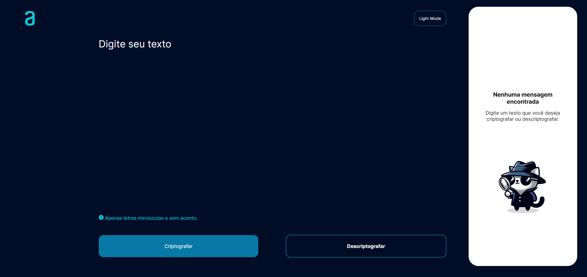
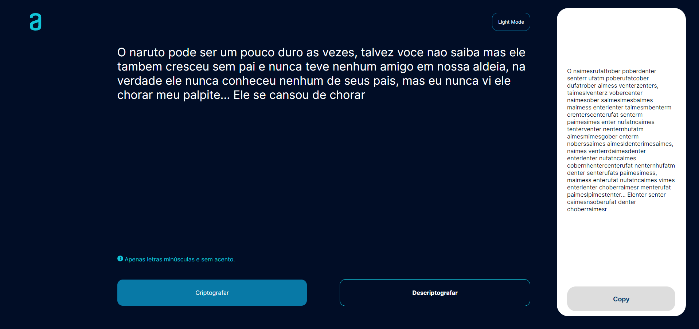
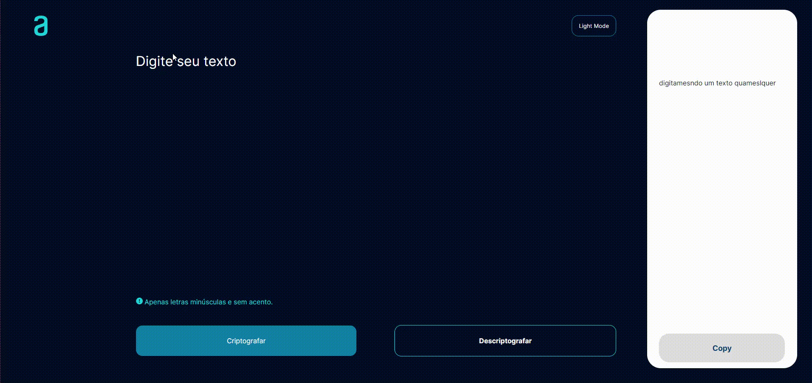
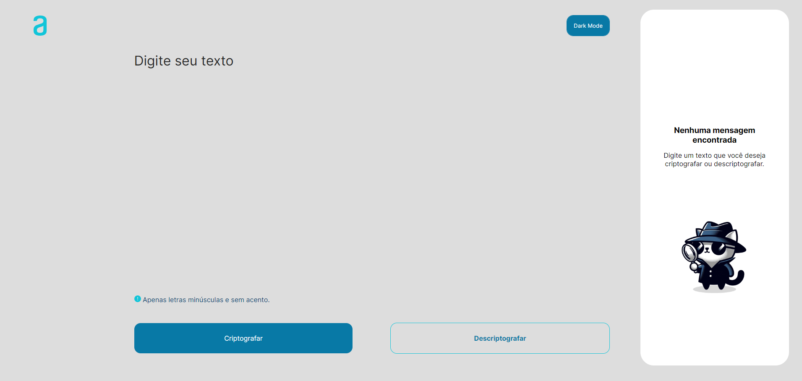
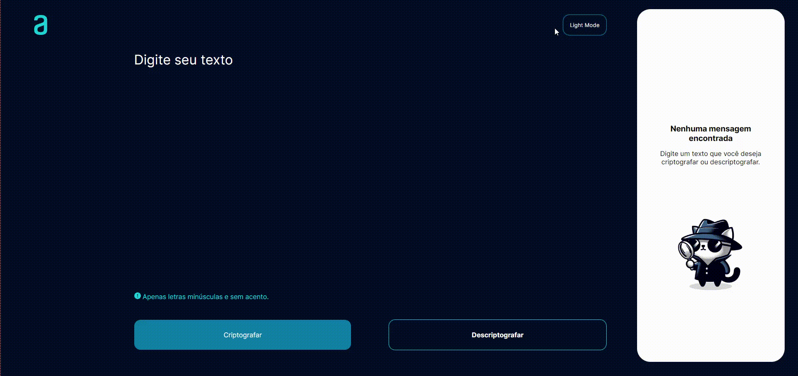
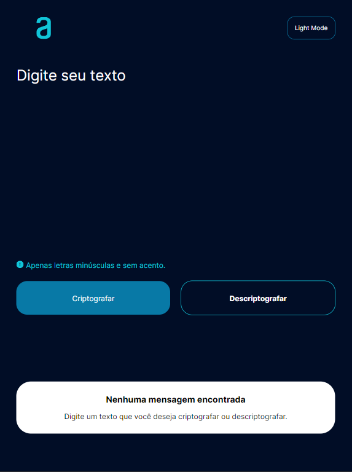
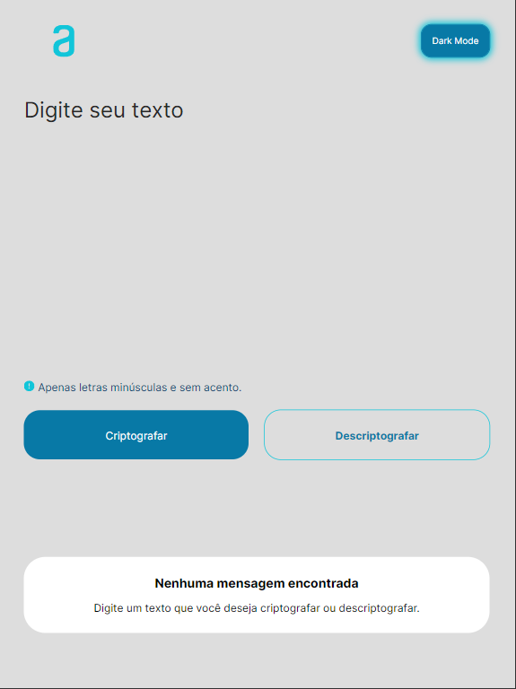
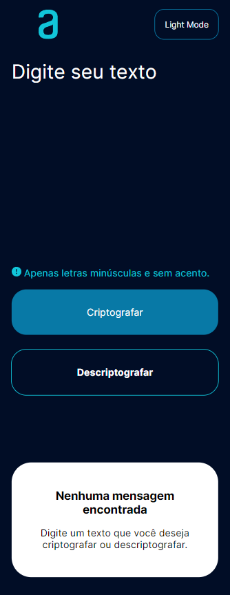
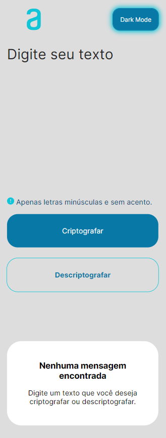

# Decodificador de Texto

### Abrir e rodar o projeto:

https://leandrocamilo09.github.io/Codificador/

## Objetivo:

&nbsp;Colocar em prática os conhecimentos adquirido no curso da Alura.

## Sobre o projeto:

&nbsp;O projeto é uma plataforma para criptografar e descriptografar mensagens com a opção adicional de copiar o texto.

### Como funciona?

&nbsp;O usuário digita a mensagem e seleciona a opção "Criptografar" ou "Descriptografar" em seguida o resultado da operação aparecerá no lado direito da página.

&nbsp;O Codificador irá substituir as vogais da mensagem pelas palavras chaves abaixo.

| Letra | Palavra Chave |
| :---: | :-----------: |
|  "e"  |    "enter"    |
|  "i"  |    "imes"     |
|  "a"  |     "ai"      |
|  "o"  |    "ober"     |
|  "u"  |    "ufat"     |

&nbsp;O processo inverso acontece quando o usuáro deseja descriptografar uma mensagem.

**Ressalvas:** A mensagem digitada pelo usuário deve conter apenas letras minúsculas e sem acentos.

- Exemplo 01:
  
- Exemplo 02:
  

#

### Acessibilidade visual:

&nbsp;A plataforma se preocupa com usuários que possuem alguma dificiência visual leve. Com isso em mente, dedicamos atenção especial à escolha das **cores, contrastes, estilos e tamanhos das fontes.** Além disso, implementamos um botão de **Light/Dark Mode** que permite ao usuário ajustar o padrão de cores conforme sua preferência de conforto.

- Exemplo 01:
  
  
- Exemplo 02:
  

#

## Dispositivos:

&nbsp;Além do computador, o projeto também foi adaptado para telas de **Tabletes** e **Celulares.**

- Tablete: 
  
  

- Celular: 
  
  

#

## Tecnologias utilizadas:

- `JavaScript`
- `HTML`
- `Css`

## Equipe:

Leandro Camilo.

## Feedback pessoal:

&nbsp;O projeto foi extremamente gratificante para mim, proporcionando uma familiaridade muito maior com a linguagem JavaScript, que até então eu conhecia apenas superficialmente. Durante o desenvolvimento, busquei funcionalidades nativas da linguagem e soluções para compatibilidade de versões da IDE, o que foi essencial para elaborar a lógica eficaz necessária desse projeto.

&nbsp;No que diz respeito ao front-end, aproveitei a oportunidade para aplicar meus conhecimentos em HTML e CSS, o que foi muito enriquecedor.

&nbsp;Espero que todos apreciem tanto quanto eu apreciei trabalhar neste projeto.

#

## Observação:

A ideia de projeto e modelo de design da página é de autoria do curso da alura. O projeto atual difere do original em cores, imagens e botão de Light/Dark-Mode.
